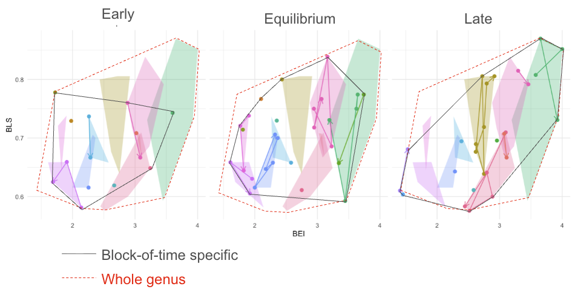

I am a general ecologist and evolutionary biologist whose research spans broad questions at the intersection of ecology, evolution, and biodiversity science. My ongoing research is centered on the following themes:

# The biology of extinction

Why do some species survive environmental change while others go extinct? To tackle this central question at the interface between ecology and evolution, I use data science tools to weave together diverse strands of evidence—fossils, global wildlife surveys, and the tree of life. This is currently being conducted at the [Swain Lab](https://www.anshumanswain.com/home), as part of my Postdoctoral Fellowship at [U. of Michigan's the Institute for Global Change Biology](https://seas.umich.edu/globalchangebiology)

You can watch me presenting the preliminary results of this project [here](https://youtu.be/GSZz7fqlxn4?t=3624).

{.inset-center}

# Speciation and the origins of biodiversity

How and why did life become so diverse? I address this topic by exploring the gap between micro- and macroevolution and investigating whether processes within populations give rise to the structure of biodiversity across the broadest scales of time and space.

My work related to this topic was recently published on [The American Naturalist](https://www.journals.uchicago.edu/doi/full/10.1086/734457) and in [Ecology Letters](https://onlinelibrary.wiley.com/doi/full/10.1111/ele.70021).

You can watch me presenting the preliminary results of a new project I am conducting on speciation, which I recently presented as part of the symposium "Cross-Disciplinary Approaches for Understanding Budding Speciation" that I co-organized with Bruno do Rosario Petrucci in the 2026 Evolution Meeting:  [link for the whole symposium here](https://www.youtube.com/watch?v=AUJ-AkoVJBE&t=1s).

{.inset-center}

# Comparative demography

How do ecological and evolutionary processes interact to shape a population’s ability to persist, adapt, and spread across space? Do these demographic properties vary among species at the same scale as their traits, or are they more—or less—conserved? Answering these questions is a central goal of my research.

My work related to this topic was recently published in [Ecology Letters](https://onlinelibrary.wiley.com/doi/full/10.1111/ele.70021) and in [The American Naturalist](https://www.journals.uchicago.edu/doi/full/10.1086/734457).

{.inset-center}

# New methods and software in Ecology and Evolution

Exploring new research directions often requires developing new methods to extract and organize information from primary natural history data. Furthermore, modern software allow us to ask questions at scales that earlier naturalists could hardly have imagined. I build tools that help turn those possibilities into reality.

To some extend I am always building new tools, but perhaps my most prominent published, standalone software is [`paleobuddy`](https://github.com/brpetrucci/paleobuddy/tree/master), an R ecosystem to research budding speciation which I co-developed with Bruno do Rosario Petrucci. We are growing this ecosystem slowly but steadily, so reach out if you have any ideas for collaboration.

{.inset-center}

# Phylogenetic natural history

What does biodiversity actually look like when we step back and try to describe it in general terms? What are its most universal patterns, and at which spatial or evolutionary scales do they emerge? And why do these patterns sometimes change when we compare small groups of organisms to much larger ones? There are many of these fundamental questions on scale that deeply interest me and inspire the way I test hypotheses about the natural world.

{.inset-center}

# The evolution of complexity

How does the co-variation among traits change over time? And how important are those changes for shaping the diversity of life we see today?

My work on this topic is still in progress, but [my recent review of the MIT Press _Evolvability_ book](https://academic.oup.com/evolut/article-abstract/78/8/1517/7676513) provides a glimpse into how I approach these questions.

{.inset-center}

